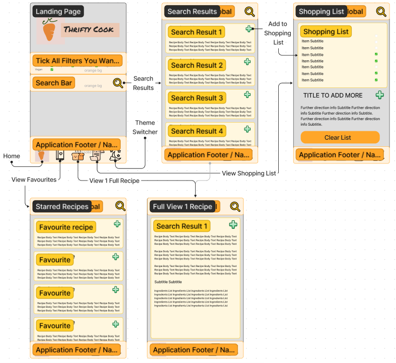
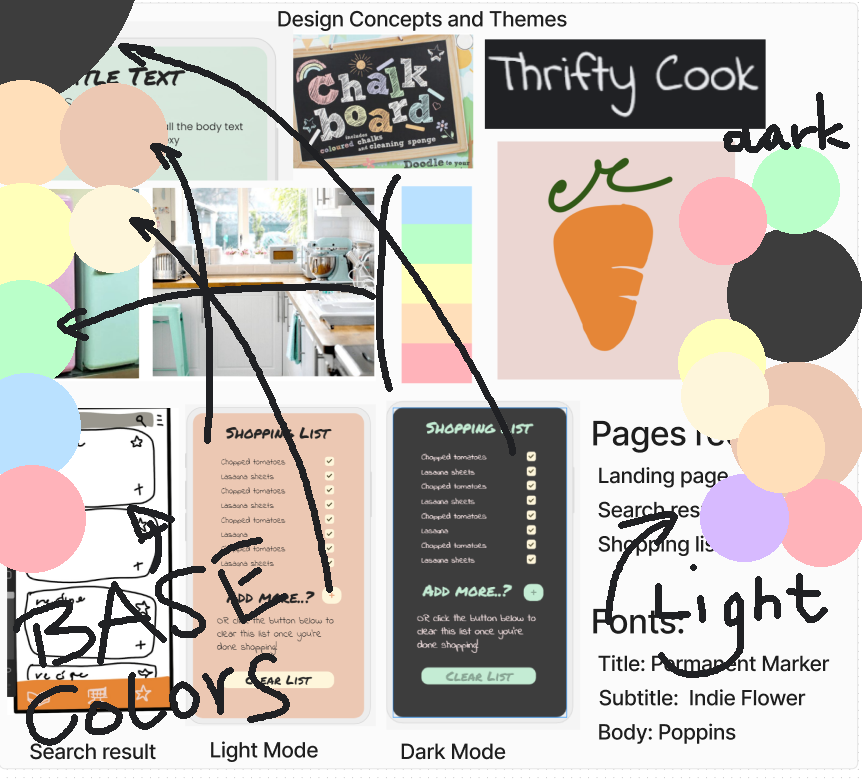

# Code First Girls Mobile Development +masters Course Final Project Documentation

# Thrifty Cook

### Developed by:
- [Joanna Bek](https://github.com/asikowe)
- [Anna Lewandowska](https://github.com/anna-lewandowska)
- [Rebecca Jewers](https://github.com/FuckinGandalfMan)
- [Susanna Parolo](https://github.com/susannaparolo)

-----------------------------------------------------------------------

## INTRODUCTION

### Aim & objective of our project: 

### What are we building? What are the key features of our application?

We'v'e built a grocery list generator. Our application enables the user to browse 5,000+ recipes via the [Spoonacular API](https://spoonacular.com/food-api), view them, add them to user’s own favourites list and/or to generate the grocery shopping list for the recipe or recipes selected by the user. 

Thanks to the level of detail provided by the API we were able to calculate exactly how much of each item is needed for each recipe selected, generating a precise grocery list (e.g we will add tomatoes needed to make a tomato soup and a tomato pasta, updating the grocery list as you go).

### Why are we building this in particular? What’s our vision & goal?

We wanted to create an application to facilitate the process of the weekly meal prep. With this application the user can focus on recipe selection as the grocery shopping list will be auto generated, they don’t need to write anything down manually and remember to take the notebook or piece of paper where they jotted it down with them when going shopping. We imagine this should save up some time and relieve some stress of the users of our application.

---------------------------------------------------------------------

## SPECIFICATIONS AND DESIGN 

This application wass designed for personal use, under the assumption that just like a mobile phone is used by 1 person, this application will also be used by 1 and the same person, owner of the phone - therefore we chose not to implement the multiple user functionality with registration, user verification, multiple accounts & logging in.

### Core architecture & features:

- Search bar to search through the recipes
- Recipes returned by search presented on cards in a scrolling view
- Full view of a selected recipe on a separate screen
- Shopping cart icon adding selected recipe’s ingredients to the shopping list
- Star icon adding selected recipe to the favourites list
- Favourite recipes list page (screen)
- Shopping list page (screen)
- Navigation bar with iconed tabs to navigate between the pages (screens)
- Chalkboard inspired application look / style complete with a hand drawn icon

### Possible future development ideas:

- Light & Dark Themes with an easy to use switch
- Imperial & Metric unit measure switch
- Same ingredient quantities sum up (not to have the same ingredient listed twice on the grocery list)
- Clickable filters enabling the user to filter & limit the search results by their preferences such as food allergies, dietary requirements
- Allow multiple user usage (multiple lists or multiple users)

### Application's Wireframe:

### Design & Color Code Moodboard:

We decided that since the application is created mostly with UK users in mind, we will go with a design idea that seemed most appealing to UK users - a dark anthracite chalkboard with powdery pastel colour accents with possible reference to pantone kitchen and iconic SMEG appliance design was one of our ideas, but we also wanted to include the cute carrot drawn by Susanna which we all really liked:

-----------------------------------------------------------------------

## IMPLEMENTATION AND EXECUTION 

### Development approach and team member roles: 

We started off from deciding what our application should be doing as its chief function, then gave ourselves a couple of days to come up with propositions and moodboard ideas. On our next meeting we have presented our ideas, clarified 1 moodboard from them, drew up the wireframe, listed up key features in Trello and declared who is tentatively interested in doing what. We kept tracking our progress with Slack & Trello holding approximately biweekly meetings on Google Meet to discuss the issues we’ve encountered, review the progress and assign new tasks.

### Tools and libraries used:

We've planned to use React Native with Redux, and we were able to stick with this plan. We needed to use additional libraries for the navigation bar (react-navigation/bottom-tabs), the icons (react-native-ionicons), adding to the shopping & favourites lists (react-native-async-storage/async-storage, redux, redux-persist and redux-thunk) and for the light/dark theme switch (rneui/base, rneui/themed, react-context and react-native-paper).

For the recipes, we decided to use the [Spoonacular API](https://spoonacular.com/food-api) at the beginning of this project.

We've also used Visual Studio Code, Node.js package manager, Expo and Git for version control.

### Design tools used:

Figma for moodboard & design, Photoshop for icons & colour coding our app

Colours used in the process of designing the app are stored in Colors.txt file with description, hex & RBG values - even the colours which are not presently being used are saved there for legacy purposes, also they might be used for developing themes in the future.

### Planning & Project Management tools used:

Jamboard, Trello Board, Slack, Google Meet and Zoom

### Implementation process highlights:

Challenge & Achievement : The star for adding recipes to favourites list fills in when a recipe is added to the favourite recipes list and removes the filling back to outline of a star only when a recipe is not in the favourite recipes list.

Challenge & Achievement : After some trial and not much error it was decided to stick to JS styling for language coherency (a few items such as the bottom tab navigation bar could not be styled in CSS, only in JS, and only in the hardcoded way).

Challenge & Decision to change : Due to lack of success with the Light & Dark switch we’ve removed it from the final submission version of our project. 

---------------------------------------------------------------------------

## TESTING AND EVALUATION

### Functional and user testing:

Search bar was tested via input, navigation was tested by clicking through. Testing for items rendering & positioning was successful.

### System limitations:

This app is designed for 1 user only, for personal use. If multiple users would wish to use it on the same phone, they will need to share the shopping and favourites lists for now.

---------------------------------------------------------------------------

## CONCLUSION

We are glad to be able to deliver the project which has properly working key features and looks nice on the eyes, reflecting the original design ideas and moodboard we had in mind. 
