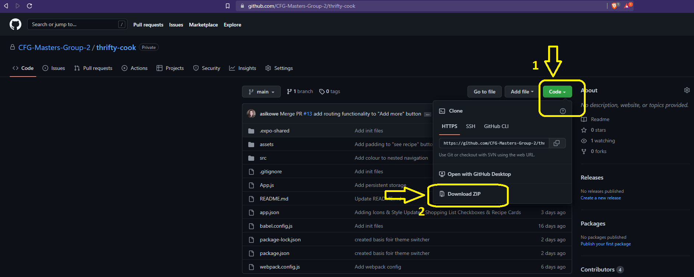

# Thrifty Cook - Code First Girls +masters Course Project

Version: 0.8.0  
Date: 20 SEP 2022  

----------------------------------------------------

# USER MANUAL TABLE OF CONTENTS

1. Software Description & Key Features 👀
2. Documentation & Video Presentation 🎬
3. System Requirements 💯
4. Set-up Guide 🐣
5. How-to Tutorials 🎬
- How to find a recipe
- How to add recipe/s to the shopping list
- How to view, edit & clear shopping list
- How to add a recipe to favourites (starred)
6. Contributors & Support 💬

----------------------------------------------------

## Software Description 👀

Thrifty Cook is a grocery list generator which will assist your meal planning & grocery shopping. You can browse & select the recipes you wish to cook in the upcoming days and Thrifty Cook will return a shopping list of ingredients required to make the meals you’ve selected. You can save more frequently used recipes as favourites.

## Key Features ⭐

- Browse 5000+ recipes
- Select & view a recipe
- Add / remove ingredients of the chosen recipe to your "Shopping Cart" list
- Save / remove your favourite recipes in "Starred Recipes" list

## Project Documentation & Video Presentation 🎬

[Short Project Presentation .PDF](https://github.com/AnnaFromPoland/thrifty-cook/blob/main/documentation/thrifty-cook.pdf)  
[Project Presentation Video .MP4](https://github.com/AnnaFromPoland/thrifty-cook/blob/main/documentation/thrifty-cook-app-presentation.mp4)  
[Full Project Documentation .MD](https://github.com/AnnaFromPoland/thrifty-cook/blob/main/documentation/DOCUMENTATION.md)  

----------------------------------------------------

## System Requirements 💯

1. IDE such as Virtual Studio Code - [Download VS Code for Free](https://code.visualstudio.com/Download)
2. Node.js package manager (npm) - [Download Node.js for Free](https://nodejs.org/en/download)
3. Expo (to render the mobile application) - [Download Expo for Free](https://docs.expo.dev/get-started/installation)

## Setup Guide 🐣

1. Have an IDE & Node.js installed on your computer and Expo on your mobile phone (See point #6 "Additional Resources" for installation links & guides)
2. Download this repository as a .zip file with Thrifty Cook application, save it on your computer:

3. Unpack the .zip file on your computer (right click + unpack to location / unpack here)
4. Open your IDE
5. Open the unpacked folder with Thrifty Cook application in the IDE by either dragging & dropping the unzipped folder over to the IDE or opening the unzipped folder in IDE with "File > Open folder" option and navigating to the folder's location
6. Open a new terminal in your IDE
7. Type the below command to install modules used by Thrifty Cook:
```sh
npm install
```
8. Once the installation of additional modules is finished, type the below command to run the application:
```sh
npm start
```
9. Application is now running, to access it go to Expo on your mobile phone and connect to the localhost running Thrifty Cook either by scanning the QR code with your phone or connecting to the exp:// address returned in the terminal by typing it in Expo manually.

----------------------------------------------------

## How-to Tutorials 📑

#### How to find a recipe?

In the app, click the “Search” tab.
In the “Search” bar atop the page, type your search keyword, for example “pasta”.

#### How to view the full recipe with cooking instructions?

With the recipes showing in the “Search” page, choose one and click the *see recipe* button to view the full recipe with its cooking intructions. 
You can return to the search results page by clicking the arrow in top menu or the "Search" tab in the bottom navigation menu.

#### How to add recipe/s to the shopping list?

With the recipes showing in the “Search” page, choose one and click the *cart icon* to add this recipe’s ingredients to the shopping list.
Go back to the “Search” page to find/select another recipe and add it to the shopping list.
You can always view your shopping list in the "List" page.

#### How to view, edit & clear shopping list?

You can check the ingredients you already have by tapping the checkbox next to that ingredient. You can clear the shopping list using the “Clear List” button.

#### How to add a recipe to favourites (starred)?

With the recipes showing in the “Search” page, choose one and click the *star icon* _once_ to add this recipe’s ingredients to the favourites (starred) list. Clicking the star icon for the _second time_ will remove the recipe from the favourites list. 

The presence of the recipe in the starred recipes is indicated by the *star icon* - empty outline means the recipe is not currently in the favourite recipes list, while a full star icon with filling means the recipe is currently added in the favourite recipes list.
You can view your favourite recipes list any time in the “Starred” tab.

#### How to remove a recipe from favourites (starred)?

Go to “Starred” tab to view your favourite recipes list. To remove a recipe from this list, click the star icon.

----------------------------------------------------

## Contributors & Support 💬
- [Joanna Bek](https://github.com/asikowe)
- [Anna Lewandowska](https://github.com/anna-lewandowska)
- [Rebecca Jewers](https://github.com/FuckinGandalfMan)
- [Susanna Parolo](https://github.com/susannaparolo)
